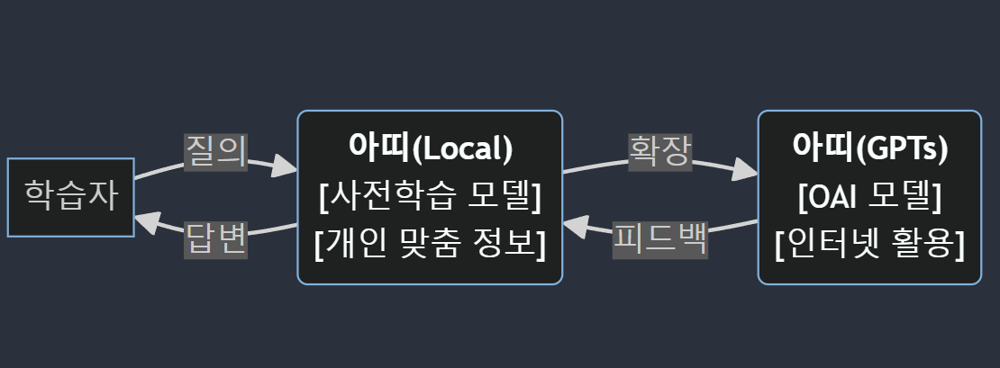

# Atti 소개
> 느린 학습자의 친한 친구 "아띠(Atti)"   

Atti(이하 "아띠")는 느린 학습자의 상황판단 또는 대처에 도움을 주는 범용 AI챗봇입니다.   

'친한친구'를 뜻하는 순우리말 '아띠'와 같은 이름의 이 챗봇은   
평소 일상생활에는 문제가 없으나 갑작스런 돌발상황에 대처가 서투른 특징을 가진 느린 학습자들이 좀 더 효과적인 대응을 할 수 있도록 돕습니다.   

## 느린 학습자(slow learner)란?   
'느린 학습자' 또는 '경계선 지능자' 라고 불리는 분들은   
표준화된 지능검사 결과가 지능 지수(IQ) 전체 평균인 100점을 기준으로 IQ 71점 이상 84점 이하에 해당하며, 전체 인구의 12~14%(국내기준 80만명 가량)정도로 추산됩니다.  
    
이들은 감정표현, 의사소통이 서투르거나 돌발상황에 대한 대처능력이 부족할 때가 있습니다.   
그러나 지적장애에는 해당하지 않기 때문에 각종 복지제도나 지원 등의 대상이 되지 못하며, 적절한 도움이 필요한 상황에서 소외되는 경우가 많습니다.

## 어떤 도움을 줄 수 있을까?
아띠의 목표는 아래와 같습니다.   

1. 개별 학습자의 필요와 수준에 맞추어 개인화된 학습 경험을 제공하며, 
2. 반복적인 질문에도 지속적이고 즉각적인 피드백 제공해 학습자의 이해도를 높이고 
3. 친근하고 이해하기 쉬운 인터페이스를 통해 학습자들이 보다 쉽게 접근하고 사용하도록 설계하는것 입니다.

이와 같은 목표들이 느린 학습자들의 어려움에 도움이 되고, 나아가 사회적인 변화를 이루기를 바랍니다.

# 구현방법

아띠의 기본적인 개념도 입니다.   
1. 사용자가 문제상황에 대해 질의를 합니다.(예: 폐식용유를 안전하게 처리하는 법 등)
2. 아띠(local)모델이 질의를 받고 사전학습된 정보를 바탕으로 1차 답변을 생성합니다.
3. 아띠(local)에서 생성한 답변을 ChatGPT API를 활용해 GPTs에 생성되어있는 아띠(GPTs)로 전달합니다.
4. 아띠(GPTs)는 전달받은 답변을 기초로 좀 더 정교하고 효과적인 답변을 생성하여 반환합니다.
5. 사용자들은 답변을 활용하여 문제를 해결합니다.

위와같은 단계를 거처 느린 학습자들에게 필요한 답변을 제공하게 됩니다.

## 아띠(Local)
아띠(Local)는 사용자의 질의를 1차적으로 처리하는 프로그램입니다.   
프로그램 내 내장되어있는 언어모델을 활용하여 질의내용을 분석하고, 사전에 학습된 자료를 기반으로 1차 답변이자 아띠(GPTs)로 보낼 질의를 생성합니다.   
이 과정에서 이전에 아띠를 사용한 이력이 있다면 미리 저장된 사용자 개인 맞춤 정보(연령, 성별 등)를 활용할 수 있습니다.

### 로컬모델의 사전 학습자료
현재 인터넷에 공개되어있는 아래의 느린 학습자 관련 자료를 활용하여 답변의 신뢰성을 높였습니다.  
* 자료1   
* 자료2

## 아띠(GPTs)
아띠(GPTs)는 OpenAI의 GPTs 서비스 내에 생성되어있는 챗봇입니다.  
프롬포트 엔지니어링으로 ChatGPT를 느린 학습자들에게 적합하도록 커스텀 하였으며, 아띠(Local)보다 높은 성능 및 인터넷 활용 등 기능을 활용해 아띠(Local)와 API로 통신하며 1차적으로 생성한 답변을 보완해주는 역할을 합니다.

### 적용된 사전 프롬포트
> 예시

# 관련 링크
* github: https://github.com/caffeint/atti
* 아띠GPTs: https://chatgpt.com/g/g-eh4gm7Y6H-neurinhagseubjareul-wihan-gpt
* 로컬모델 다운로드:  